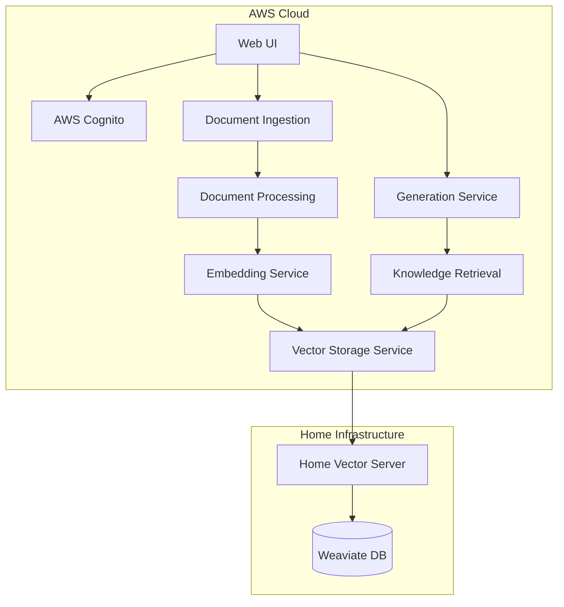
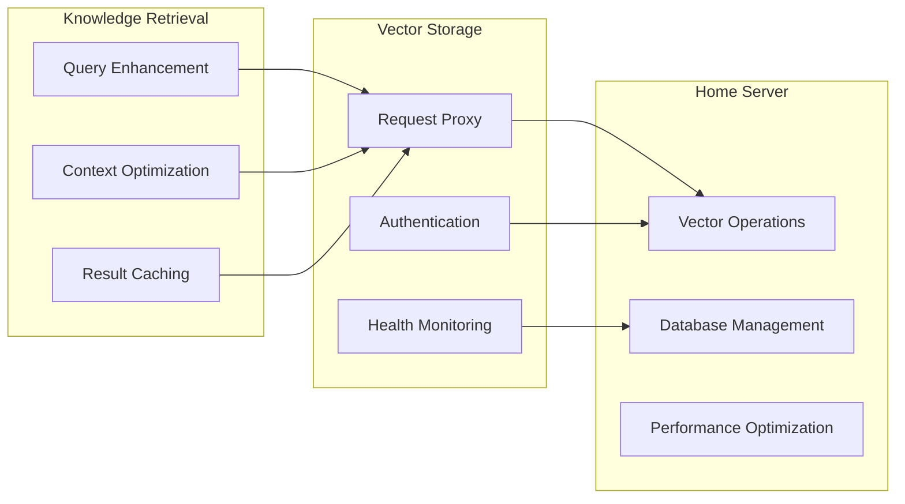
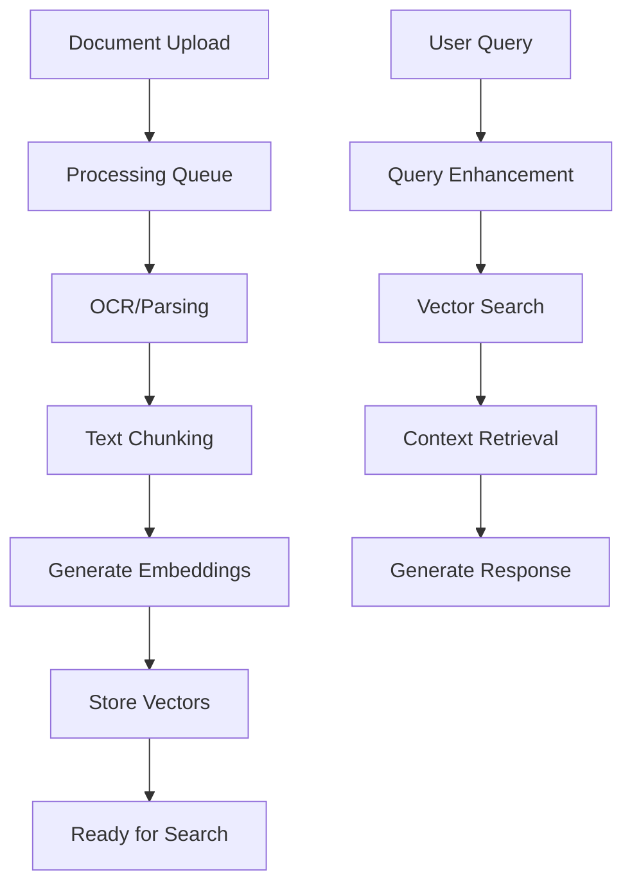

# 🏗️ **Hybrid RAG Architecture**

## 🎯 **Executive Summary**

Our **Hybrid RAG** architecture combines **AWS enterprise services** with a **cost-effective home vector database**, delivering 85% cost savings while maintaining enterprise-grade security and performance.

## 🏛️ **Core Architecture**



## 🔄 **Simplified Data Flow**

### **Document Ingestion Flow**
1. **Web UI** → Document upload to S3
2. **Document Processing** → OCR/parsing via Lambda (ECS for heavy loads)
3. **Embedding Service** → Generate embeddings via Bedrock
4. **Vector Storage** → Store embeddings in home server
5. **Home Vector Server** → Persist to Weaviate database

### **Query/Generation Flow**
1. **Web UI** → User query
2. **Generation Service** → Orchestrate RAG pipeline
3. **Knowledge Retrieval** → Optimize context and query enhancement
4. **Vector Storage** → Proxy to home server for vector search
5. **Generation Service** → Generate response via Bedrock

## 🚀 **Service Breakdown**

### **1. Document Ingestion Service**
- **Purpose**: Secure document upload and preprocessing
- **Tech**: Lambda, S3, JWT authentication
- **Code Reduction**: 88% (3,500 → 415 lines)

### **2. Document Processing Service**
- **Purpose**: OCR, parsing, chunking of documents
- **Tech**: Lambda (primary), ECS Fargate (hybrid scaling)
- **Handles**: PDF, Word, images, structured data

### **3. Embedding Service** 
- **Purpose**: Convert text to vector embeddings
- **Tech**: AWS Bedrock (Titan Embeddings)
- **Technology**: AWS Bedrock (cost-optimized choice)

### **4. Vector Storage Service** ✨ **SIMPLIFIED**
- **Purpose**: **Simple secure proxy** to home vector database
- **Components**: 
  - Vector Proxy API (forwards requests)
  - Health Check (monitors connectivity)
- **NOT responsible for**: Complex sync, processing, or intelligence

### **5. Knowledge Retrieval Service**
- **Purpose**: Intelligent context optimization and query enhancement
- **Features**: Query rewriting, context ranking, result caching
- **Calls**: Vector Storage Service for actual vector operations

### **6. Generation Service**
- **Purpose**: RAG orchestration and response generation
- **Tech**: AWS Bedrock (Claude/Llama models)
- **Flow**: Knowledge Retrieval → Vector Storage → Bedrock

### **7. Home Vector Server**
- **Purpose**: High-performance vector database hosting
- **Tech**: Node.js, Weaviate, JWT validation
- **Security**: Hidden behind AWS proxy, SSL/TLS encryption

## 🛡️ **Security Architecture**

### **Authentication Flow**
```
User → Cognito → JWT Token → AWS Services → Home Server
```

- **Single Sign-On**: Cognito handles all authentication
- **JWT Validation**: Both AWS and home server verify same token
- **Zero Direct Access**: Home server never exposed to internet

### **Network Security**
- **AWS API Gateway**: Public-facing endpoints with Cognito auth
- **Home Server**: Private network, accessed only via AWS proxy
- **Encryption**: TLS 1.3 for all communications

## 💰 **Cost Optimization Results**

| Component | Before (OpenSearch) | After (Home Server) | Savings |
|-----------|-------------------|-------------------|---------|
| **Vector Storage** | $345/month minimum | $1-7/month (proxy) | 98% |
| **Compute** | Limited scaling | Full control | Variable |
| **Development** | $345 per environment | Shared resources | 100% |
| **Cold Starts** | 15-30 seconds | None | Performance |
| **Total** | ~$400+/month | ~$50-100/month | **85%** |

## 🔧 **Simplified Vector Storage Role**

### **What Vector Storage Service Does** ✅
- Secure proxy to home vector database
- JWT authentication and validation
- Health monitoring and connectivity checks
- Request/response forwarding with CORS

### **What Vector Storage Service Does NOT Do** ❌
- Complex S3 synchronization logic
- Vector processing or optimization
- Context ranking or query enhancement
- Direct vector database operations
- Data transformation or validation

## 🎯 **Service Responsibilities**



## 🚀 **Deployment Strategy**

### **AWS Services** (Serverless)
```bash
# Deploy each service independently
cd rag-document-ingestion-service && cdk deploy
cd rag-document-processing-service && cdk deploy
cd rag-embedding-service && cdk deploy
cd rag-vector-storage-service && cdk deploy
cd rag-knowledge-retrieval-service && cdk deploy
cd rag-generation-service && cdk deploy
```

### **Home Vector Server** (Docker)
```bash
cd home-vector-server
docker-compose up -d
```

## 📊 **Performance Metrics**

### **Latency Targets**
- **Document Upload**: < 2 seconds
- **Vector Search**: < 500ms
- **Response Generation**: < 5-10 seconds
- **End-to-End RAG**: < 15 seconds

### **Throughput Capabilities**
- **Document Processing**: 100+ docs/hour
- **Vector Operations**: 1000+ searches/minute
- **Concurrent Users**: 50+ simultaneous queries

## 🔄 **Data Lifecycle**



## 🎯 **Key Benefits Achieved**

1. **Cost Reduction**: 85% savings vs managed solutions
2. **Performance**: No cold starts, sub-second search
3. **Security**: Enterprise-grade auth with home privacy
4. **Scalability**: Independent service scaling
5. **Maintainability**: Simple, focused service responsibilities

## 🛠️ **Technology Stack**

### **AWS Services**
- **Compute**: Lambda (primary), ECS Fargate (future scaling)
- **Storage**: S3, DynamoDB
- **AI/ML**: Bedrock (Titan, Claude)
- **Auth**: Cognito
- **API**: API Gateway
- **Monitoring**: CloudWatch, X-Ray

### **Home Infrastructure**
- **Database**: Weaviate (vector database)
- **Runtime**: Node.js, TypeScript
- **Containerization**: Docker, Docker Compose
- **Security**: SSL/TLS, JWT validation

## 🔍 **Monitoring & Observability**

### **AWS CloudWatch**
- Service health and performance metrics
- API Gateway request/response logging
- Lambda function execution metrics

### **Home Server Monitoring**
- Weaviate database performance
- System resource utilization
- Network connectivity status

This architecture provides enterprise-grade RAG capabilities with significant cost savings, maintaining security while leveraging the best of both cloud and on-premises infrastructure. 