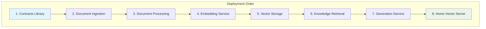

# 🚀 OnDemandEnv RAG System Deployment Guide

## 📋 Prerequisites

### AWS Requirements
- **AWS Account** with administrative access
- **AWS CLI** configured with appropriate permissions
- **AWS CDK** v2.x installed globally
- **Node.js** 18+ and npm
- **Docker** and Docker Compose

### Home Server Requirements
- **Linux Server** (Ubuntu 20.04+ recommended)
- **Minimum Hardware**: 8GB RAM, 4 CPU cores, 100GB storage
- **Network**: Static IP address and domain name
- **Ports**: 22 (SSH), 80 (HTTP), 443 (HTTPS)

### Development Tools
- **Git** for version control
- **TypeScript** compiler
- **Code Editor** (VS Code recommended)

## 🏗️ Architecture Overview



## 🔧 Step 1: Environment Setup

### AWS Configuration

```bash
# Install AWS CLI
curl "https://awscli.amazonaws.com/awscli-exe-linux-x86_64.zip" -o "awscliv2.zip"
unzip awscliv2.zip
sudo ./aws/install

# Configure AWS credentials
aws configure
# AWS Access Key ID: [Your Access Key]
# AWS Secret Access Key: [Your Secret Key]
# Default region name: us-east-1
# Default output format: json

# Install AWS CDK
npm install -g aws-cdk
cdk --version
```

### Repository Setup

```bash
# Clone repository
git clone https://github.com/your-org/odmd-rag.git
cd odmd-rag

# Install all dependencies
npm run install-all

# Bootstrap CDK (one-time setup)
cdk bootstrap
```

## 📦 Step 2: Deploy Contracts Library

```bash
# Navigate to contracts library
cd contractsLib-rag

# Install dependencies
npm install

# Build contracts
npm run build

# Verify contracts
npm test

# The contracts library doesn't deploy infrastructure
# It provides type definitions for other services
cd ..
```

## 🌐 Step 3: Deploy Document Ingestion Service

```bash
cd rag-document-ingestion-service

# Install dependencies
npm install

# Configure environment
cp .env.example .env
# Edit .env with your configuration

# Deploy to development
cdk deploy RagDocumentIngestionStack-dev \
  --parameters userPoolId=YOUR_USER_POOL_ID \
  --parameters userPoolClientId=YOUR_CLIENT_ID

# Deploy to production
cdk deploy RagDocumentIngestionStack-prod \
  --parameters userPoolId=YOUR_USER_POOL_ID \
  --parameters userPoolClientId=YOUR_CLIENT_ID

# Note the API Gateway URL from output
cd ..
```

## ⚙️ Step 4: Deploy Document Processing Service

```bash
cd rag-document-processing-service

# Install dependencies
npm install

# Build Docker image for ECS
docker build -t rag-document-processor .

# Deploy infrastructure
cdk deploy RagDocumentProcessingStack-dev

# Deploy to production
cdk deploy RagDocumentProcessingStack-prod

cd ..
```

## 🧠 Step 5: Deploy Embedding Service

```bash
cd rag-embedding-service

# Install dependencies
npm install

# Deploy development environment
cdk deploy RagEmbeddingStack-dev

# Deploy production environment
cdk deploy RagEmbeddingStack-prod

# Verify Bedrock permissions
aws bedrock list-foundation-models --region us-east-1

cd ..
```

## 🗄️ Step 6: Deploy Vector Storage Service

```bash
cd rag-vector-storage-service

# Install dependencies
npm install

# Configure home server endpoint
export HOME_SERVER_URL=https://your-domain.com

# Deploy development
cdk deploy RagVectorStorageStack-dev \
  --parameters homeServerUrl=$HOME_SERVER_URL

# Deploy production
cdk deploy RagVectorStorageStack-prod \
  --parameters homeServerUrl=$HOME_SERVER_URL

cd ..
```

## 🔍 Step 7: Deploy Knowledge Retrieval Service

```bash
cd rag-knowledge-retrieval-service

# Install dependencies
npm install

# Deploy development
cdk deploy RagKnowledgeRetrievalStack-dev

# Deploy production
cdk deploy RagKnowledgeRetrievalStack-prod

cd ..
```

## ✨ Step 8: Deploy Generation Service

```bash
cd rag-generation-service

# Install dependencies
npm install

# Deploy development
cdk deploy RagGenerationStack-dev

# Deploy production
cdk deploy RagGenerationStack-prod

# Verify Bedrock model access
aws bedrock list-foundation-models --region us-east-1

cd ..
```

## 🏠 Step 9: Setup Home Vector Server

### Server Preparation

```bash
# SSH into your home server
ssh user@your-server-ip

# Update system
sudo apt update && sudo apt upgrade -y

# Install Docker
curl -fsSL https://get.docker.com -o get-docker.sh
sh get-docker.sh
sudo usermod -aG docker $USER

# Install Docker Compose
sudo curl -L "https://github.com/docker/compose/releases/download/v2.20.0/docker-compose-$(uname -s)-$(uname -m)" -o /usr/local/bin/docker-compose
sudo chmod +x /usr/local/bin/docker-compose

# Logout and login to apply group changes
exit
ssh user@your-server-ip
```

### SSL Certificate Setup

```bash
# Install Certbot
sudo apt install certbot nginx -y

# Stop nginx temporarily
sudo systemctl stop nginx

# Generate SSL certificate
sudo certbot certonly --standalone -d your-domain.com

# Configure nginx
sudo nano /etc/nginx/sites-available/rag-vector-server
```

**Nginx Configuration** (`/etc/nginx/sites-available/rag-vector-server`):
```nginx
server {
    listen 443 ssl http2;
    server_name your-domain.com;
    
    ssl_certificate /etc/letsencrypt/live/your-domain.com/fullchain.pem;
    ssl_certificate_key /etc/letsencrypt/live/your-domain.com/privkey.pem;
    
    # Security headers
    add_header Strict-Transport-Security "max-age=31536000; includeSubDomains" always;
    add_header X-Frame-Options DENY always;
    add_header X-Content-Type-Options nosniff always;
    
    location / {
        proxy_pass http://localhost:3000;
        proxy_set_header Host $host;
        proxy_set_header X-Real-IP $remote_addr;
        proxy_set_header X-Forwarded-For $proxy_add_x_forwarded_for;
        proxy_set_header X-Forwarded-Proto $scheme;
    }
}

server {
    listen 80;
    server_name your-domain.com;
    return 301 https://$server_name$request_uri;
}
```

```bash
# Enable the site
sudo ln -s /etc/nginx/sites-available/rag-vector-server /etc/nginx/sites-enabled/
sudo nginx -t
sudo systemctl start nginx
sudo systemctl enable nginx
```

### Deploy Home Vector Server

```bash
# Copy home server code to server
scp -r home-vector-server/ user@your-server-ip:~/

# SSH into server
ssh user@your-server-ip
cd home-vector-server

# Configure environment
cp .env.example .env
nano .env
```

**Environment Configuration** (`.env`):
```bash
# Server Configuration
PORT=3000
NODE_ENV=production

# AWS Cognito Configuration
COGNITO_REGION=us-east-1
COGNITO_USER_POOL_ID=us-east-1_xxxxxxxxx
COGNITO_CLIENT_ID=your-client-id

# Weaviate Configuration
WEAVIATE_URL=http://weaviate:8080
WEAVIATE_API_KEY=your-api-key

# Security Configuration
JWT_SECRET=your-jwt-secret
CORS_ORIGIN=https://your-domain.com

# Performance Configuration
REDIS_URL=redis://redis:6379
MAX_CONNECTIONS=100
```

```bash
# Start services
docker-compose up -d

# Verify services are running
docker-compose ps

# Check logs
docker-compose logs -f home-vector-server
```

## 🔒 Step 10: Security Configuration

### Firewall Setup

```bash
# Configure UFW firewall
sudo ufw default deny incoming
sudo ufw default allow outgoing
sudo ufw allow 22/tcp
sudo ufw allow 80/tcp
sudo ufw allow 443/tcp
sudo ufw enable
```

### SSL Certificate Auto-Renewal

```bash
# Add certbot renewal to crontab
sudo crontab -e

# Add this line:
0 12 * * * /usr/bin/certbot renew --quiet --post-hook "systemctl reload nginx"
```

### Security Monitoring

```bash
# Install fail2ban
sudo apt install fail2ban -y

# Configure fail2ban
sudo nano /etc/fail2ban/jail.local
```

**Fail2ban Configuration** (`/etc/fail2ban/jail.local`):
```ini
[DEFAULT]
bantime = 3600
findtime = 600
maxretry = 5

[sshd]
enabled = true
port = ssh
logpath = /var/log/auth.log

[nginx-http-auth]
enabled = true
port = http,https
logpath = /var/log/nginx/error.log
```

```bash
sudo systemctl enable fail2ban
sudo systemctl start fail2ban
```

## 📊 Step 11: Monitoring & Observability

### CloudWatch Setup

```bash
# Install CloudWatch agent on home server
wget https://s3.amazonaws.com/amazoncloudwatch-agent/ubuntu/amd64/latest/amazon-cloudwatch-agent.deb
sudo dpkg -i -E ./amazon-cloudwatch-agent.deb
```

### Health Checks

```bash
# Create health check script
cat > ~/health-check.sh << 'EOF'
#!/bin/bash

# Check home vector server
curl -f http://localhost:3000/health || exit 1

# Check Weaviate
curl -f http://localhost:8080/v1/.well-known/ready || exit 1

# Check Redis
redis-cli ping || exit 1

echo "All services healthy"
EOF

chmod +x ~/health-check.sh

# Add to crontab
crontab -e
# Add: */5 * * * * /home/user/health-check.sh
```

## 🧪 Step 12: Testing & Validation

### End-to-End Testing

```bash
# Test document upload
curl -X POST "https://your-api-gateway-url/upload" \
  -H "Authorization: Bearer YOUR_JWT_TOKEN" \
  -F "file=@test-document.pdf"

# Test vector search
curl -X POST "https://your-domain.com/search" \
  -H "Authorization: Bearer YOUR_JWT_TOKEN" \
  -H "Content-Type: application/json" \
  -d '{"query": "test query", "limit": 5}'

# Test RAG generation
curl -X POST "https://your-generation-api-url/generate" \
  -H "Authorization: Bearer YOUR_JWT_TOKEN" \
  -H "Content-Type: application/json" \
  -d '{"query": "What is in the document?"}'
```

### Performance Testing

```bash
# Install Apache Bench
sudo apt install apache2-utils -y

# Test home server performance
ab -n 1000 -c 10 -H "Authorization: Bearer YOUR_JWT_TOKEN" \
  https://your-domain.com/health

# Test vector search performance
ab -n 100 -c 5 -p search-payload.json -T application/json \
  -H "Authorization: Bearer YOUR_JWT_TOKEN" \
  https://your-domain.com/search
```

## 🔄 Step 13: Continuous Deployment

### GitHub Actions Setup

Create `.github/workflows/deploy.yml`:

```yaml
name: Deploy RAG System

on:
  push:
    branches: [ main, develop ]

jobs:
  deploy-aws-services:
    runs-on: ubuntu-latest
    steps:
      - uses: actions/checkout@v3
      
      - name: Setup Node.js
        uses: actions/setup-node@v3
        with:
          node-version: '18'
          
      - name: Configure AWS credentials
        uses: aws-actions/configure-aws-credentials@v2
        with:
          aws-access-key-id: ${{ secrets.AWS_ACCESS_KEY_ID }}
          aws-secret-access-key: ${{ secrets.AWS_SECRET_ACCESS_KEY }}
          aws-region: us-east-1
          
      - name: Deploy services
        run: |
          npm run deploy:all
          
  deploy-home-server:
    runs-on: ubuntu-latest
    needs: deploy-aws-services
    steps:
      - uses: actions/checkout@v3
      
      - name: Deploy to home server
        uses: appleboy/ssh-action@v0.1.5
        with:
          host: ${{ secrets.HOME_SERVER_HOST }}
          username: ${{ secrets.HOME_SERVER_USER }}
          key: ${{ secrets.HOME_SERVER_SSH_KEY }}
          script: |
            cd home-vector-server
            git pull origin main
            docker-compose down
            docker-compose up -d --build
```

## 📈 Step 14: Scaling & Optimization

### Auto-Scaling Configuration

```bash
# Configure ECS auto-scaling
aws application-autoscaling register-scalable-target \
  --service-namespace ecs \
  --scalable-dimension ecs:service:DesiredCount \
  --resource-id service/rag-processing-cluster/rag-processing-service \
  --min-capacity 1 \
  --max-capacity 10

# Configure Lambda concurrency
aws lambda put-provisioned-concurrency-config \
  --function-name rag-embedding-processor \
  --provisioned-concurrency-config ProvisionedConcurrencyConfig=10
```

### Performance Optimization

```bash
# Optimize home server
echo 'vm.swappiness=10' | sudo tee -a /etc/sysctl.conf
echo 'net.core.somaxconn=65535' | sudo tee -a /etc/sysctl.conf
sudo sysctl -p

# Optimize Docker
echo '{"log-driver":"json-file","log-opts":{"max-size":"10m","max-file":"3"}}' | sudo tee /etc/docker/daemon.json
sudo systemctl restart docker
```

## 🎯 Troubleshooting

### Common Issues

1. **CDK Deployment Failures**
   ```bash
   # Check CloudFormation events
   aws cloudformation describe-stack-events --stack-name YourStackName
   
   # Verify IAM permissions
   aws sts get-caller-identity
   ```

2. **Home Server Connection Issues**
   ```bash
   # Check firewall status
   sudo ufw status
   
   # Verify SSL certificate
   openssl s_client -connect your-domain.com:443
   
   # Check Docker services
   docker-compose ps
   docker-compose logs
   ```

3. **JWT Authentication Failures**
   ```bash
   # Verify Cognito configuration
   aws cognito-idp describe-user-pool --user-pool-id YOUR_POOL_ID
   
   # Test JWT validation
   curl -H "Authorization: Bearer YOUR_TOKEN" https://your-domain.com/health
   ```

### Monitoring Commands

```bash
# Check system resources
htop
df -h
free -h

# Monitor Docker containers
docker stats

# Check application logs
docker-compose logs -f --tail=100

# Monitor network connections
sudo netstat -tulpn | grep :443
```

## 📚 Additional Resources

### Documentation Links
- [AWS CDK Documentation](https://docs.aws.amazon.com/cdk/)
- [AWS Bedrock User Guide](https://docs.aws.amazon.com/bedrock/)
- [Weaviate Documentation](https://weaviate.io/developers/weaviate)
- [OnDemandEnv Platform Guide](https://ondemandenv.github.io)

### Support Channels
- **GitHub Issues**: Report bugs and feature requests
- **Discord Community**: Real-time support and discussions
- **Documentation**: Comprehensive guides and tutorials

---

This deployment guide provides step-by-step instructions for setting up the complete OnDemandEnv RAG System with enterprise-grade security and performance. 