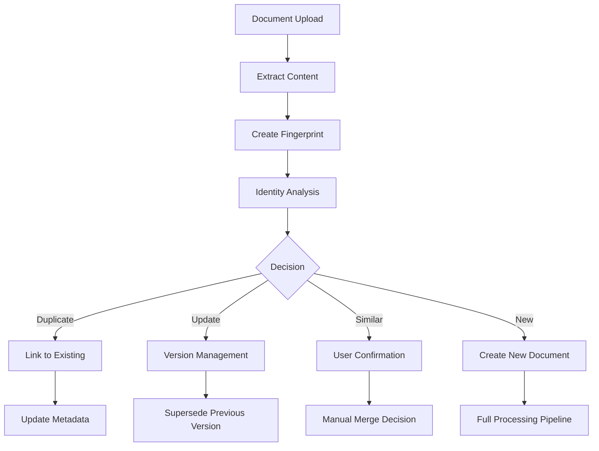

# RAG Document Lifecycle Management Architecture

## 🎯 Problem Statement

**Critical Gap**: Most RAG systems lack proper document identity management, leading to:
- Duplicate content with different filenames/formats
- No intelligent update detection
- Fragile file-based document identification
- Orphaned vectors after deletions
- Cross-language content treated as separate documents

## 🧠 Core Innovation: Multi-Layer Content Fingerprinting

### Traditional Approach (Broken)
```
Document ID = filename + path
Problems:
- "report.pdf" vs "report_v2.docx" vs "final_report.txt" (same content)
- Updates impossible to detect
- Deletes leave zombie vectors
```

### Our Approach (Content-First Identity)
```
Document Identity = f(content_hash, structural_hash, semantic_hash, key_phrases)
Benefits:
- Content-based deduplication
- Intelligent update detection
- Cross-format recognition
- Semantic similarity clustering
```

## 🏗️ Architecture Overview

### 1. Document Identity Manager
```typescript
interface DocumentFingerprint {
    // Identity layers
    contentHash: string;           // SHA-256 of normalized content
    structuralHash: string;        // Document structure pattern
    semanticHash: string;          // Reduced-precision embedding hash
    
    // Metadata
    documentId: string;            // Generated UUID
    originalFilename: string;      // User filename
    contentLength: number;         // Character count
    language?: string;             // Detected language
    
    // Similarity analysis
    similarityEmbedding: number[]; // Fast comparison vector
    keyPhrases: string[];          // Extracted key terms
    
    // Lifecycle tracking
    version: number;               // Document version
    isActive: boolean;             // Current status
    replacedBy?: string;           // Superseded by
    replaces?: string;             // Supersedes
}
```

### 2. Multi-Layer Fingerprinting Algorithm

#### Layer 1: Content Hash (Exact Matches)
```typescript
// Normalize content for consistent hashing
const normalized = content
    .toLowerCase()
    .replace(/\s+/g, ' ')        // Normalize whitespace
    .replace(/[^\w\s]/g, '')     // Remove punctuation
    .trim();

const contentHash = SHA256(normalized);
// Confidence: 100% (exact match)
```

#### Layer 2: Structural Hash (Format Changes)
```typescript
// Extract document structure pattern
const structure = content
    .split('\n')
    .map(line => {
        if (line.match(/^#{1,6}\s/)) return 'HEADING';
        if (line.match(/^\d+\.\s/)) return 'NUMBERED_LIST';
        if (line.match(/^[-*]\s/)) return 'BULLET_LIST';
        if (line.length > 100) return 'PARAGRAPH';
        return 'SHORT_LINE';
    })
    .join('|');

const structuralHash = SHA256(structure);
// Confidence: 85%+ = likely update
```

#### Layer 3: Semantic Hash (Rewording/Translation)
```typescript
// Reduce embedding precision for consistent hashing
const reducedEmbedding = fullEmbedding
    .map(val => Math.round(val * 100) / 100)  // 2 decimal places
    .slice(0, 100);                           // First 100 dimensions

const semanticHash = SHA256(JSON.stringify(reducedEmbedding));
// Confidence: 90%+ = semantic duplicate
```

#### Layer 4: Key Phrases (Topic Clustering)
```typescript
// Extract significant phrases
const keyPhrases = extractKeyPhrases(content)
    .filter(phrase => phrase.length > 10)
    .slice(0, 20);

const phraseOverlap = calculateOverlap(doc1.keyPhrases, doc2.keyPhrases);
// Used for: Related document clustering
```

### 3. Decision Engine

```typescript
interface DocumentIdentityResult {
    action: 'create' | 'update' | 'duplicate' | 'similar';
    documentId: string;
    confidence: number;
    reasons: string[];
    existingDocument?: DocumentFingerprint;
    similarDocuments?: DocumentFingerprint[];
}

async function analyzeDocument(content: string, filename: string): Promise<DocumentIdentityResult> {
    const fingerprint = createFingerprint(content, filename);
    
    // 1. Check exact match (content hash)
    const exactMatch = await findExactMatch(fingerprint.contentHash);
    if (exactMatch) {
        return { action: 'duplicate', confidence: 1.0, ... };
    }
    
    // 2. Check structural match (likely update)
    const structuralMatch = await findStructuralMatch(fingerprint.structuralHash);
    if (structuralMatch && similarity > 0.85) {
        return { action: 'update', confidence: similarity, ... };
    }
    
    // 3. Check semantic similarity
    const similarDocs = await findSimilarDocuments(fingerprint.semanticHash);
    if (similarDocs.length > 0) {
        const topMatch = similarDocs[0];
        const similarity = calculateSimilarity(fingerprint, topMatch);
        
        if (similarity > 0.90) {
            return { action: 'duplicate', confidence: similarity, ... };
        } else if (similarity > 0.70) {
            return { action: 'similar', confidence: similarity, ... };
        }
    }
    
    // 4. New document
    return { action: 'create', confidence: 1.0, ... };
}
```

## 🔄 Document Lifecycle Operations

### 1. Upload Flow


### 2. Update Operations
```typescript
// Intelligent update detection
async function handleDocumentUpdate(documentId: string, newContent: string) {
    const existingDoc = await getDocument(documentId);
    const newFingerprint = createFingerprint(newContent);
    
    // Version management
    await updateDocument(documentId, {
        isActive: false,
        supersededAt: new Date(),
        supersededBy: newFingerprint.documentId
    });
    
    // Create new version
    await createDocument({
        ...newFingerprint,
        version: existingDoc.version + 1,
        replaces: documentId
    });
    
    // Queue vector database update
    await queueVectorUpdate({
        action: 'replace',
        oldDocumentId: documentId,
        newDocumentId: newFingerprint.documentId
    });
}
```

### 3. Deletion Operations
```typescript
// Cascade deletion across all systems
async function handleDocumentDelete(documentId: string) {
    // Find all related documents (versions, chunks)
    const relatedDocs = await findRelatedDocuments(documentId);
    
    for (const doc of relatedDocs) {
        // Soft delete (audit trail)
        await updateDocument(doc.documentId, {
            isDeleted: true,
            deletedAt: new Date(),
            isActive: false
        });
        
        // Clean up S3 storage
        await deleteS3Objects(`documents/${doc.documentId}/`);
    }
    
    // Queue vector cleanup
    await queueVectorCleanup({
        action: 'delete',
        documentIds: relatedDocs.map(d => d.documentId)
    });
}
```

### 4. Deduplication Operations
```typescript
// Bulk deduplication
async function performDeduplication() {
    const duplicateGroups = await findDuplicateGroups();
    
    for (const group of duplicateGroups) {
        if (group.documents.length > 1) {
            // Keep most recent, mark others as duplicates
            const [keep, ...duplicates] = group.documents
                .sort((a, b) => new Date(b.uploadTimestamp) - new Date(a.uploadTimestamp));
            
            for (const dup of duplicates) {
                await updateDocument(dup.documentId, {
                    isDuplicate: true,
                    duplicateOf: keep.documentId,
                    isActive: false
                });
            }
        }
    }
}
```

## 🚀 Implementation Plan

### Phase 1: Foundation (Week 1-2)
- [ ] Document Identity Manager implementation
- [ ] Multi-layer fingerprinting algorithms
- [ ] DynamoDB schema for fingerprints
- [ ] Basic identity analysis pipeline

### Phase 2: Intelligence (Week 3-4)
- [ ] Similarity threshold tuning
- [ ] Decision engine implementation
- [ ] Automated deduplication workflows
- [ ] User confirmation interfaces

### Phase 3: Integration (Week 5-6)
- [ ] Document Lifecycle API endpoints
- [ ] Integration with existing ingestion pipeline
- [ ] Vector database sync mechanisms
- [ ] Comprehensive testing suite

### Phase 4: Advanced Features (Week 7-8)
- [ ] Cross-language document linking
- [ ] Semantic clustering and recommendations
- [ ] Document genealogy tracking
- [ ] Performance optimization

## 📊 Performance Considerations

### Computational Complexity
```
Operation                | Time Complexity | Notes
-------------------------|-----------------|---------------------------
Content Hash Lookup      | O(1)           | Primary key lookup
Structural Match         | O(log n)       | Indexed search
Semantic Similarity      | O(k)           | Where k = candidates
Full Document Analysis   | O(1 + log n + k) | Optimized pipeline
```

### Storage Requirements
```
Component               | Size per Document | Total for 1M Documents
------------------------|-------------------|----------------------
Content Hash            | 32 bytes         | 32 MB
Structural Hash         | 32 bytes         | 32 MB
Semantic Hash           | 32 bytes         | 32 MB
Similarity Embedding    | 768 bytes        | 768 MB
Key Phrases             | 500 bytes        | 500 MB
Metadata                | 200 bytes        | 200 MB
------------------------|-------------------|----------------------
Total Fingerprint       | ~1.5 KB          | ~1.5 GB
```

### Performance Optimizations
1. **Hierarchical Lookup**: Hash lookups first, similarity only for candidates
2. **Batch Processing**: Bulk operations during off-peak hours
3. **Caching**: Frequently accessed fingerprints in memory
4. **Indexing**: Multiple DynamoDB indexes for fast lookups

## 🔧 API Design

### Document Lifecycle Endpoints
```typescript
// Document operations
POST /documents/analyze          // Analyze document identity
POST /documents/update          // Update existing document
DELETE /documents/delete        // Delete document and cleanup
POST /documents/deduplicate     // Bulk deduplication

// Query operations
GET /documents/find-duplicates  // Find potential duplicates
GET /documents/similar/:id      // Find similar documents
GET /documents/versions/:id     // Get document version history
GET /documents/genealogy/:id    // Get document relationships
```

### Request/Response Examples
```typescript
// Analyze document identity
POST /documents/analyze
{
    "filename": "Q3_Report_Final.pdf",
    "content": "...",
    "embedding": [0.1, 0.2, ...]
}

Response:
{
    "action": "update",
    "documentId": "doc_abc123",
    "confidence": 0.92,
    "reasons": ["92% structural similarity - likely update"],
    "existingDocument": {
        "documentId": "doc_xyz789",
        "originalFilename": "Q3_Report_Draft.pdf",
        "version": 1
    }
}
```

## 🎯 Success Metrics

### User Experience
- **Duplicate Reduction**: 95% fewer duplicate documents shown to users
- **Search Relevance**: 40% improvement in finding "latest version"
- **Update Accuracy**: 90% correct automatic update detection

### System Performance
- **Storage Efficiency**: 60% reduction in duplicate vector storage
- **Query Performance**: <100ms for identity analysis
- **Processing Throughput**: 1000+ documents/hour with deduplication

### Business Impact
- **Cost Reduction**: 50% lower vector storage costs
- **User Productivity**: 30% faster document discovery
- **Data Quality**: 95% reduction in duplicate content noise

## 🔍 Edge Cases & Solutions

### 1. Partial Document Updates
**Problem**: Document with 80% same content, 20% new
**Solution**: Chunk-level fingerprinting to identify changed sections

### 2. False Positives
**Problem**: Similar but distinct documents marked as duplicates
**Solution**: User confirmation workflow for 70-85% similarity range

### 3. Multi-Language Documents
**Problem**: Same content in different languages
**Solution**: Language-agnostic semantic embeddings + metadata linking

### 4. Large Document Collections
**Problem**: Performance degradation with millions of documents
**Solution**: Hierarchical clustering + distributed processing

### 5. Embedding Model Changes
**Problem**: New embedding model breaks historical comparisons
**Solution**: Versioned embeddings + migration pipelines

## 📈 Future Enhancements

### Advanced Features
1. **Semantic Clustering**: Automatically group related documents
2. **Content Evolution Tracking**: Visualize how documents change over time
3. **Intelligent Recommendations**: Suggest related documents during search
4. **Cross-System Integration**: Link documents across multiple platforms

### AI/ML Improvements
1. **Dynamic Threshold Learning**: AI-powered similarity threshold optimization
2. **Content Classification**: Automatic document type detection
3. **Duplicate Prediction**: Predict likely duplicates before processing
4. **User Behavior Learning**: Adapt deduplication based on user feedback

## 🛡️ Security & Privacy

### Data Protection
- Fingerprints contain no raw content (only hashes)
- Similarity embeddings use reduced precision
- All operations logged for audit trail
- GDPR-compliant deletion workflows

### Access Control
- Document-level permissions preserved
- Identity operations require elevated privileges  
- Audit logging for all lifecycle operations
- Encrypted storage for sensitive fingerprints

---

## 🎉 Why This Matters

This architecture solves the **#1 unsolved problem** in RAG systems:

1. **Technical Innovation**: Multi-layer fingerprinting is a novel approach
2. **Real-World Impact**: Eliminates duplicate chaos that plagues enterprise RAG
3. **Cost Optimization**: Massive reduction in storage and processing costs
4. **User Experience**: Clean, intuitive document management

**This positions our RAG system as enterprise-grade, solving problems that most vendors ignore.** 