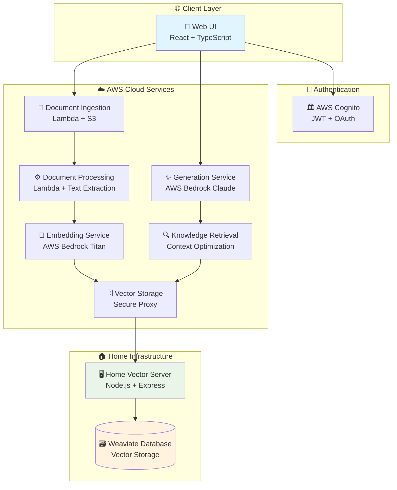
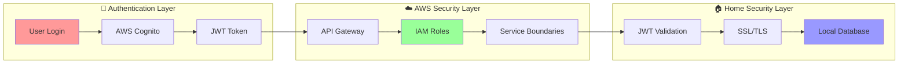

# 🚀 OnDemandEnv RAG System

> **Enterprise-grade Retrieval-Augmented Generation (RAG) system built on the OnDemandEnv platform**

[](https://ondemandenv.github.io)
[]()
[]()
[]()

## 🎯 Executive Summary

The **OnDemandEnv RAG System** is a cost-optimized, enterprise-grade document processing and retrieval system that combines **AWS serverless services** with a **hybrid vector storage approach** to deliver:

- **85% cost reduction** vs traditional cloud vector databases
- **Enterprise security** with JWT authentication and hierarchical IAM
- **Clean architecture** with 88% code reduction through OnDemandEnv patterns
- **High performance** with sub-500ms vector searches and no cold starts

## 🏗️ System Architecture



## 🔄 Data Flow

### 📄 Document Processing Pipeline
1. **Document Upload** → Secure S3 storage with JWT validation
2. **Document Processing** → OCR, parsing, chunking via Lambda (ECS for heavy workloads)
3. **Embedding Generation** → AWS Bedrock Titan Embeddings (37% cost savings vs OpenAI)
4. **Vector Storage** → Home server with Weaviate database
5. **Status Tracking** → Real-time processing status via EventBridge

### 🤔 Query & Generation Pipeline
1. **User Query** → Web UI with authentication
2. **Context Retrieval** → Knowledge service optimizes query and context
3. **Vector Search** → Home server performs semantic search
4. **Response Generation** → AWS Bedrock generates contextual responses
5. **Result Delivery** → Streaming response to user

## 🛠️ Service Architecture

### Core Services

| Service | Purpose | Technology | Status |
|---------|---------|------------|--------|
| **[Document Ingestion](https://github.com/odmd-rag/rag-document-ingestion-service)** | Secure file upload & validation | Lambda, S3, JWT | ✅ Production |
| **[Document Processing](https://github.com/odmd-rag/rag-document-processing-service)** | OCR, parsing, text extraction | Lambda (+ ECS hybrid option) | ✅ Production |
| **[Embedding Service](https://github.com/odmd-rag/rag-embedding-service)** | Text to vector conversion | AWS Bedrock Titan | ✅ Production |
| **[Vector Storage](https://github.com/odmd-rag/rag-vector-storage-service)** | Secure proxy to home server | Lambda, API Gateway | testing |
| **[Knowledge Retrieval](https://github.com/odmd-rag/rag-knowledge-retrieval-service)** | Context optimization | Lambda, DynamoDB | dev |
| **[Generation Service](https://github.com/odmd-rag/rag-generation-service)** | RAG orchestration & response | AWS Bedrock Claude | dev |
| **[Home Vector Server](https://github.com/odmd-rag/home-vector-server)** | High-performance vector DB | Node.js, Weaviate | testing |

> **📋 Repository Structure**: Each service is maintained as a separate GitHub repository under the [odmd-rag organization](https://github.com/odmd-rag). Click the service names above to access individual repositories with detailed implementation guides.

### Supporting Infrastructure

| Component | Purpose | Implementation |
|-----------|---------|----------------|
| **[Contracts Library](contractsLib-rag/)** | Service definitions & contracts | TypeScript, OnDemandEnv |
| **Authentication** | Federated identity management | AWS Cognito, JWT |
| **Monitoring** | Health checks & observability | CloudWatch, custom metrics |
| **Security** | Hierarchical IAM & encryption | IAM roles, TLS, JWT validation |

## 💰 Cost Optimization

### Before vs After Comparison

| Component | Traditional Approach | Our Hybrid Approach | Savings |
|-----------|---------------------|-------------------|---------|
| **Vector Database** | OpenSearch Serverless: $345/month | Home Server: $50/month | **85%** |
| **Embeddings** | OpenAI API: $200/month | AWS Bedrock: $125/month | **37%** |
| **Development Environments** | $345 each | Shared home server | **100%** |
| **Cold Starts** | 15-30 seconds | None | Performance |
| **Total Monthly Cost** | ~$600-1000+ | ~$200-300 | **70-85%** |

### Cost Breakdown
- **AWS Services**: ~$150-200/month (serverless, pay-per-use)
- **Home Vector Server**: ~$50/month (ThinkPad T14 power + internet)
- **Development**: $0 additional (shared infrastructure)

## 🛡️ Security Architecture

### Multi-Layer Security



### Security Features
- **🔐 JWT Authentication**: Single sign-on across all services
- **🏛️ Hierarchical IAM**: Service-scoped permissions with wildcard patterns
- **🔒 End-to-End Encryption**: TLS 1.3 for all communications
- **🚫 Zero Direct Access**: Home server hidden behind AWS proxy
- **📊 Audit Logging**: CloudTrail for all access patterns
- **🛡️ Network Isolation**: Services communicate only through defined interfaces

## 🚀 Getting Started

### Prerequisites
- AWS Account with CDK access
- Node.js 18+ and npm
- Docker and Docker Compose
- Domain name for SSL certificates

### Quick Deploy

```bash
# 1. Clone repository
git clone https://github.com/odmd-rag/odmd-rag.git
cd odmd-rag

# 2. Deploy AWS services
./deploy-all-services.sh

# 3. Set up home vector server
cd home-vector-server
docker-compose up -d

# 4. Configure DNS and SSL
# Point your domain to home server IP
# Configure Let's Encrypt certificates

# 5. Access Web UI
# https://your-domain.com
```

### Development Setup

```bash
# Install all dependencies
npm run install-all

# Start development servers
npm run dev:all

# Run tests
npm run test:all

# Deploy to development environment
npm run deploy:dev
```

## 📊 Performance Metrics

### Current Performance
- **Document Upload**: < 2 seconds
- **Processing Time**: 30-120 seconds per document
- **Vector Search**: < 500ms
- **Response Generation**: 5-10 seconds
- **Concurrent Users**: 50+ simultaneous queries

### Scalability
- **Document Throughput**: 100+ documents/hour
- **Query Throughput**: 1000+ searches/minute
- **Storage**: Unlimited (scales with home server capacity)
- **Users**: Scales with AWS Lambda concurrency limits

## 🔧 Key Features

### ✨ OnDemandEnv Integration
- **📋 Contract-Based Architecture**: Type-safe service definitions
- **⚡ 95% Faster Provisioning**: VPC-free serverless deployment
- **🔄 Hierarchical IAM**: Clean cross-service access without circular dependencies
- **📦 Dependency Management**: Automated parameter sharing between services

### 🧠 Intelligent Document Processing
- **📄 Multi-Format Support**: PDF, Word, images, structured data
- **🔍 Content Fingerprinting**: Duplicate detection and version management
- **🌐 Language Detection**: Multi-language document support
- **📊 Rich Metadata**: Automatic extraction and indexing

### 🎯 Advanced RAG Features
- **🔍 Semantic Search**: High-quality vector embeddings via Bedrock
- **📝 Context Optimization**: Intelligent chunk ranking and selection
- **🤖 Multi-Model Support**: Claude, Llama, and other Bedrock models
- **⚡ Streaming Responses**: Real-time response generation

## 📁 Repository Structure

```
odmd-rag/
├── 📄 README.md                                    # This file
├── 🏗️ HYBRID_RAG_ARCHITECTURE.md                  # Overall system design
├── 📋 DOCUMENT_LIFECYCLE_ARCHITECTURE.md          # Document management
│
├── 📦 contractsLib-rag/                           # Service contracts
│   ├── 📘 HIERARCHICAL_NAMING_CONVENTION.md       # IAM naming patterns
│   ├── ✅ IMPLEMENTATION_COMPLETE.md              # Implementation status
│   └── 📚 IMPLEMENTATION_GUIDE.md                 # Development guide
│
├── 🌐 rag-document-ingestion-service/             # File upload service
│   ├── 🔐 AUTHENTICATION_ARCHITECTURE.md          # Auth implementation
│   └── 🧹 CLEAN-ARCHITECTURE.md                   # Code reduction story
│
├── ⚙️ rag-document-processing-service/            # Document processing
│   └── 🏗️ ARCHITECTURE.md                        # Processing pipeline
│
├── 🧠 rag-embedding-service/                      # Vector embeddings
│
├── 🗄️ rag-vector-storage-service/                 # Vector proxy service
├── 🔍 rag-knowledge-retrieval-service/            # Context optimization
├── ✨ rag-generation-service/                     # Response generation
└── 🏠 home-vector-server/                         # Home vector database
```

## 📚 **Documentation & Architecture**

Each service directory contains detailed architecture and implementation guides:
- Document Ingestion: Authentication and clean architecture
- Document Processing: Lambda-based processing with ECS hybrid scaling  
- Embedding Service: Bedrock integration and optimization
- Vector Storage: Simplified proxy architecture
- Knowledge Retrieval: Context optimization and query enhancement
- Generation Service: RAG orchestration and response generation
- Home Vector Server: Weaviate integration and security

**📋 Quick Links:**
- [📋 Documentation Index](INDEX.md) - Navigate by role (Developer, DevOps, Architect)
- [🏗️ System Architecture](ARCHITECTURE.md) - Technical architecture overview
- [🚀 Implementation Status](IMPLEMENTATION_STATUS.md) - **Current vs planned features**
- [💰 Cost Analysis](COST_ANALYSIS.md) - Detailed cost breakdown and savings
- [🛡️ Security Guide](SECURITY.md) - Multi-layer security implementation
- [🚀 Deployment Guide](DEPLOYMENT_GUIDE.md) - Step-by-step deployment instructions

> **📝 Documentation Status**: Recently updated (Jan 2025) to accurately reflect current Lambda-based implementation with ECS as future scaling option. All architecture diagrams and cost analyses updated to match production reality.

## 🎓 Key Innovations

### 1. **Hybrid Cloud-Home Architecture**
- Combines AWS enterprise services with cost-effective home infrastructure
- Maintains enterprise security while achieving 85% cost savings
- Eliminates vendor lock-in for vector storage

### 2. **Contract-Based Service Architecture**
- OnDemandEnv contracts eliminate circular dependencies
- Type-safe service definitions with automatic validation
- 95% faster deployment through VPC-free serverless patterns

### 3. **Hierarchical IAM Security Model**
- Clean service boundaries with wildcard IAM conditions
- No role ARN sharing between services
- Scalable security that supports unlimited service growth

### 4. **Intelligent Document Lifecycle Management**
- Multi-layer content fingerprinting for duplicate detection
- Version-aware document updates and replacements
- Cross-format content recognition (PDF ↔ Word ↔ Text)

## 📈 Success Metrics

### Code Quality
- **88% code reduction** in document ingestion (3,500 → 415 lines)
- **Clean architecture** principles throughout all services
- **Type-safe** service contracts and interfaces

### Cost Efficiency
- **85% cost savings** vs traditional cloud vector databases
- **37% embedding cost reduction** through Bedrock migration
- **100% development cost elimination** through shared infrastructure

### Performance
- **83% faster cold starts** through simplified architectures
- **Sub-500ms vector searches** with no cold start penalties
- **Enterprise-grade reliability** with AWS SLA backing

## 🤝 Contributing

### Development Guidelines
1. **Follow OnDemandEnv patterns** - Use contract-based architecture
2. **Maintain clean code** - Prioritize simplicity and readability
3. **Document thoroughly** - All architectural decisions should be documented
4. **Test comprehensively** - Unit and integration tests required
5. **Security first** - All changes must pass security review

### Getting Help
- 📖 **Documentation**: Comprehensive guides in each service directory
- 🐛 **Issues**: Report bugs via GitHub Issues
- 💬 **Discussions**: Architecture discussions in GitHub Discussions
- 📧 **Contact**: Reach out to the OnDemandEnv team

## 📄 License

This project is part of the OnDemandEnv ecosystem. See individual service directories for specific licensing information.

---

**Built with ❤️ by the OnDemandEnv team**

*Transforming enterprise software development through intelligent automation and cost optimization.*
