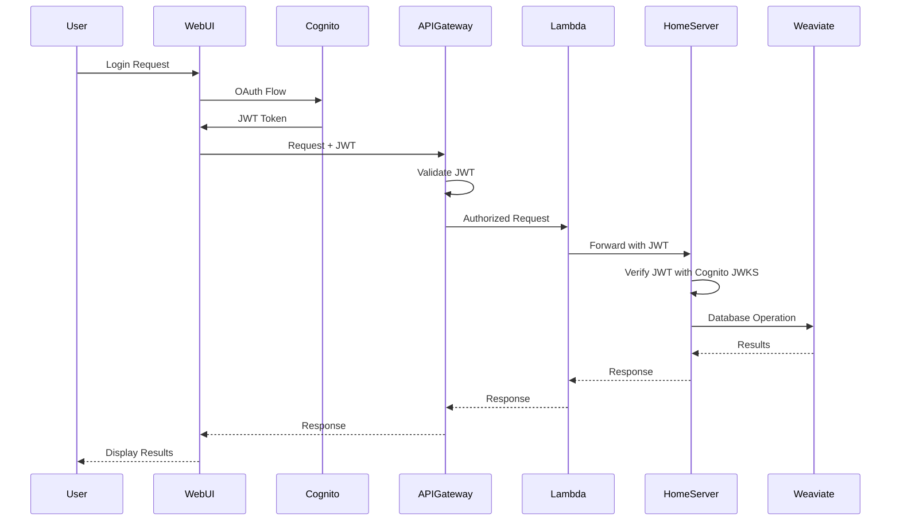
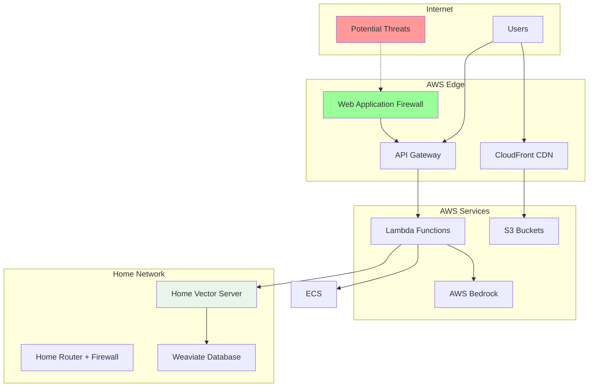
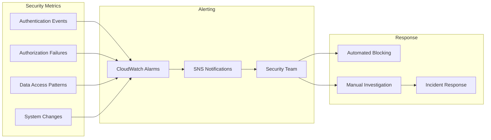

# 🛡️ OnDemandEnv RAG System Security

## 🎯 Security Overview

The OnDemandEnv RAG System implements **defense-in-depth security** with multi-layer protection spanning authentication, authorization, network security, and data protection.

## 🔐 Authentication Architecture

### JWT-Based Authentication Flow



### Cognito Integration

**User Pool Configuration**:
- **OAuth Providers**: Google OAuth 2.0
- **Token Expiration**: 1 hour (configurable)
- **Refresh Tokens**: 30 days
- **MFA Support**: Optional TOTP/SMS
- **Password Policy**: Strong password requirements

**Identity Pool Configuration**:
- **Federated Identity**: Maps JWT tokens to AWS credentials
- **Role Mapping**: Group-based role assignment
- **Session Duration**: 1 hour maximum
- **Enhanced Auth Flow**: Enabled for security

## 🏛️ Hierarchical IAM Architecture

### Service Hierarchy Structure

```
rag/
├── document-ingestion/
│   └── upload-handler-{account}-{region}
├── document-processing/
│   ├── s3-poller-{account}-{region}
│   ├── processor-{account}-{region}
│   └── dlq-handler-{account}-{region}
├── embedding/
│   ├── s3-poller-{account}-{region}
│   ├── processor-{account}-{region}
│   └── dlq-handler-{account}-{region}
├── vector-storage/
│   └── proxy-{account}-{region}
├── knowledge-retrieval/
│   └── api-{account}-{region}
└── generation/
    └── api-{account}-{region}
```

### Benefits of Hierarchical Naming

✅ **No Circular Dependencies** - Services deploy in any order  
✅ **Clean Service Boundaries** - Each service owns its hierarchy branch  
✅ **Wildcard Matching** - `rag/embedding/*` matches all embedding service roles  
✅ **Environment Isolation** - Account/region included in role names  
✅ **Scalable Security** - Easy to add new functions under existing hierarchies  

### Cross-Service Access Patterns

```typescript
// Document Processing grants access to Embedding Service
processedContentBucket.addToResourcePolicy(new iam.PolicyStatement({
    sid: 'AllowEmbeddingServiceAccess',
    effect: iam.Effect.ALLOW,
    principals: [new iam.AccountPrincipal(this.account)],
    actions: ['s3:GetObject', 's3:ListBucket'],
    resources: [
        processedContentBucket.bucketArn,
        `${processedContentBucket.bucketArn}/*`
    ],
    conditions: {
        'StringLike': {
            'aws:PrincipalArn': [`arn:aws:iam::${this.account}:role/rag/embedding/*`]
        }
    }
}));
```

## 🌐 Network Security

### AWS Network Architecture



### Network Security Layers

1. **AWS WAF**: Protects against common web exploits
2. **API Gateway**: Rate limiting and request validation
3. **VPC-Free Architecture**: Eliminates VPC complexity and attack surface
4. **Home Network Firewall**: UFW firewall with restrictive rules
5. **SSL/TLS Encryption**: End-to-end encryption for all communications

## 🏠 Home Server Security

### Server Hardening

```bash
# Firewall Configuration
sudo ufw default deny incoming
sudo ufw default allow outgoing
sudo ufw allow 22/tcp      # SSH (key-based only)
sudo ufw allow 443/tcp     # HTTPS
sudo ufw enable

# SSH Hardening
sudo sed -i 's/#PasswordAuthentication yes/PasswordAuthentication no/' /etc/ssh/sshd_config
sudo sed -i 's/#PubkeyAuthentication yes/PubkeyAuthentication yes/' /etc/ssh/sshd_config
sudo systemctl restart ssh

# Automatic Security Updates
sudo apt install unattended-upgrades
sudo dpkg-reconfigure -plow unattended-upgrades
```

### SSL/TLS Configuration

```nginx
# Nginx SSL Configuration
server {
    listen 443 ssl http2;
    server_name your-domain.com;
    
    # SSL Certificates (Let's Encrypt)
    ssl_certificate /etc/letsencrypt/live/your-domain.com/fullchain.pem;
    ssl_certificate_key /etc/letsencrypt/live/your-domain.com/privkey.pem;
    
    # Security Headers
    add_header Strict-Transport-Security "max-age=31536000; includeSubDomains" always;
    add_header X-Frame-Options DENY always;
    add_header X-Content-Type-Options nosniff always;
    add_header X-XSS-Protection "1; mode=block" always;
    add_header Referrer-Policy "strict-origin-when-cross-origin" always;
    
    # SSL Configuration
    ssl_protocols TLSv1.2 TLSv1.3;
    ssl_ciphers ECDHE-RSA-AES256-GCM-SHA512:DHE-RSA-AES256-GCM-SHA512;
    ssl_prefer_server_ciphers off;
    ssl_session_cache shared:SSL:10m;
    ssl_session_timeout 10m;
    
    location / {
        proxy_pass http://localhost:3000;
        proxy_set_header Host $host;
        proxy_set_header X-Real-IP $remote_addr;
        proxy_set_header X-Forwarded-For $proxy_add_x_forwarded_for;
        proxy_set_header X-Forwarded-Proto $scheme;
    }
}
```

### JWT Validation Implementation

```typescript
// Home Server JWT Validation
import jwt from 'jsonwebtoken';
import jwksClient from 'jwks-rsa';

class JWTValidator {
    private jwksClient: jwksClient.JwksClient;
    
    constructor(private userPoolId: string, private region: string) {
        this.jwksClient = jwksClient({
            jwksUri: `https://cognito-idp.${region}.amazonaws.com/${userPoolId}/.well-known/jwks.json`,
            cache: true,
            cacheMaxAge: 600000, // 10 minutes
            rateLimit: true,
            jwksRequestsPerMinute: 10
        });
    }
    
    async validateToken(token: string): Promise<jwt.JwtPayload> {
        return new Promise((resolve, reject) => {
            jwt.verify(token, this.getKey.bind(this), {
                algorithms: ['RS256'],
                issuer: `https://cognito-idp.${this.region}.amazonaws.com/${this.userPoolId}`,
                tokenUse: 'id'
            }, (err, decoded) => {
                if (err) reject(err);
                else resolve(decoded as jwt.JwtPayload);
            });
        });
    }
    
    private getKey(header: jwt.JwtHeader, callback: jwt.SigningKeyCallback) {
        this.jwksClient.getSigningKey(header.kid!, (err, key) => {
            if (err) callback(err);
            else callback(null, key?.getPublicKey());
        });
    }
}
```

## 🔒 Data Security

### Encryption at Rest

| Component | Encryption Method | Key Management |
|-----------|------------------|----------------|
| **S3 Buckets** | AES-256 (SSE-S3) | AWS Managed |
| **DynamoDB** | AES-256 | AWS Managed |
| **ECS Volumes** | AES-256 | AWS Managed |
| **Weaviate Database** | AES-256 (Docker volume) | Self-managed |
| **Home Server Logs** | File system encryption | Self-managed |

### Encryption in Transit

| Connection | Protocol | Certificate |
|------------|----------|-------------|
| **User ↔ AWS** | TLS 1.3 | AWS Certificate Manager |
| **AWS ↔ Home Server** | TLS 1.3 | Let's Encrypt |
| **Home Server ↔ Weaviate** | TLS 1.3 | Self-signed (internal) |
| **Service ↔ Service** | HTTPS | AWS Certificate Manager |

### Data Classification

```typescript
// Data Classification Schema
interface DataClassification {
    level: 'public' | 'internal' | 'confidential' | 'restricted';
    retention: number; // days
    encryption: boolean;
    auditRequired: boolean;
}

const documentClassification: DataClassification = {
    level: 'confidential',
    retention: 2555, // 7 years
    encryption: true,
    auditRequired: true
};

const vectorEmbeddings: DataClassification = {
    level: 'internal',
    retention: 365, // 1 year
    encryption: true,
    auditRequired: false
};
```

## 📊 Security Monitoring

### CloudTrail Integration

```typescript
// Security Event Monitoring
interface SecurityEvent {
    eventType: 'authentication' | 'authorization' | 'data_access' | 'system_change';
    userId: string;
    sourceIP: string;
    userAgent: string;
    resource: string;
    action: string;
    timestamp: string;
    success: boolean;
    riskScore: number;
}

// Automated Alerting
const securityAlerts = {
    multipleFailedLogins: { threshold: 5, timeWindow: 300 }, // 5 failures in 5 minutes
    suspiciousIP: { enabled: true, geoBlocking: ['CN', 'RU'] },
    dataExfiltration: { threshold: 1000, metric: 'documentsPerHour' },
    privilegeEscalation: { enabled: true, monitorRoleChanges: true }
};
```

### Security Metrics Dashboard



## 🔍 Security Compliance

### Compliance Framework

| Standard | Requirement | Implementation |
|----------|-------------|----------------|
| **SOC 2 Type II** | Access Controls | Hierarchical IAM + JWT |
| **ISO 27001** | Data Protection | Encryption at rest/transit |
| **GDPR** | Data Privacy | Retention policies + deletion |
| **HIPAA** | Healthcare Data | Not applicable (general documents) |

### Audit Trail

```typescript
// Comprehensive Audit Logging
interface AuditLog {
    timestamp: string;
    userId: string;
    action: string;
    resource: string;
    sourceIP: string;
    userAgent: string;
    success: boolean;
    details: Record<string, any>;
    dataHash: string; // Integrity verification
}

// Audit Requirements
const auditConfig = {
    retention: 2555, // 7 years
    encryption: true,
    immutable: true,
    realTimeMonitoring: true,
    alertingEnabled: true
};
```

## 🚨 Incident Response

### Security Incident Classification

| Severity | Description | Response Time | Escalation |
|----------|-------------|---------------|------------|
| **Critical** | Data breach, system compromise | 15 minutes | CISO, Legal |
| **High** | Service disruption, failed attacks | 1 hour | Security Team |
| **Medium** | Policy violations, suspicious activity | 4 hours | IT Team |
| **Low** | Minor policy violations | 24 hours | System Admin |

### Automated Response Actions

```typescript
// Automated Security Response
interface SecurityResponse {
    trigger: string;
    actions: string[];
    escalation: boolean;
    notification: string[];
}

const securityResponses: SecurityResponse[] = [
    {
        trigger: 'multiple_failed_logins',
        actions: ['block_ip', 'disable_user', 'alert_admin'],
        escalation: true,
        notification: ['security-team@company.com']
    },
    {
        trigger: 'data_exfiltration_detected',
        actions: ['block_user', 'isolate_system', 'emergency_alert'],
        escalation: true,
        notification: ['ciso@company.com', 'legal@company.com']
    }
];
```

## 🎯 Security Best Practices

### Development Security

1. **Secure Coding Practices**
   - Input validation and sanitization
   - SQL injection prevention
   - XSS protection
   - CSRF token validation

2. **Dependency Management**
   - Regular security updates
   - Vulnerability scanning
   - License compliance
   - Supply chain security

3. **Secret Management**
   - No hardcoded secrets
   - AWS Secrets Manager integration
   - Environment-specific configurations
   - Automatic secret rotation

### Operational Security

1. **Access Management**
   - Principle of least privilege
   - Regular access reviews
   - Multi-factor authentication
   - Session management

2. **Monitoring & Alerting**
   - Real-time security monitoring
   - Automated threat detection
   - Incident response procedures
   - Regular security assessments

3. **Business Continuity**
   - Disaster recovery planning
   - Regular backup testing
   - Incident response drills
   - Security awareness training

---

This security architecture ensures the OnDemandEnv RAG System maintains enterprise-grade security while delivering high performance and cost efficiency.